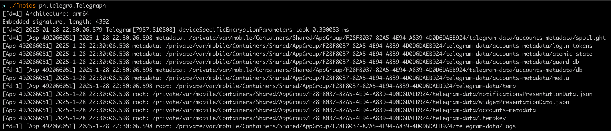

# fnoios
fnoios (_Frida_ _No_ _ios_-deploy) is a Frida based tool that reads from FDs (stdout, stderr and other open FDs) from specific iOS application. In situations where you would like to see what 
the app logs but you cannot spawn the application with `ios-deploy` you can utilize this. You need to have `frida-devkit` installed previously.

# Installation

_Using go install_

```bash
$ go install github.com/nsecho/fnoios@latest
```

_Manually_

```bash
iOS read output

Usage:
  fnoios [app] [flags]

Flags:
  -h, --help   help for fnoios
```


